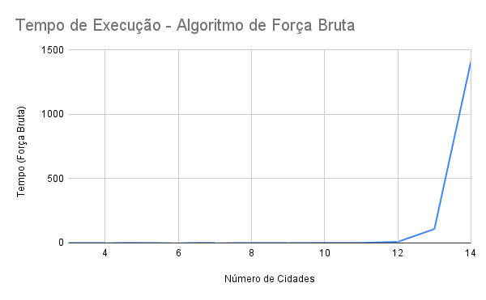
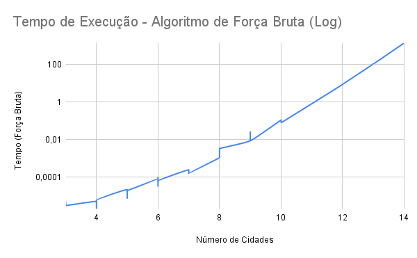

# SCC0202 - Algoritmos e Estruturas de Dados I

## Relatório - Projeto 1

### Alunos
- Pedro Henrique de Sousa Prestes (NUSP: 15507819)
- Dante Brito Lourenço (NUSP: 15447326)
- João Gabriel Pieroli da Silva (NUSP: 15678578)

### Introdução

No projeto da disciplina de Algoritmos e Estruturas de Dados I, ministrada pelo Dr. Rudinei Goularte do Instituto de Ciências Matemáticas e de Computação (ICMC), foi proposta a construção de um algoritmo para a resolução do Problema do Caixeiro Viajante (PCV) utilizando estruturas de dados estudadas em sala de aula.

O PCV envolve a necessidade de um representante comercial visitar várias cidades e retornar à cidade de origem, minimizando o custo total da viagem. No contexto deste projeto, o custo é definido pela distância percorrida, onde o usuário fornece a quantidade de cidades, a cidade de origem e as arestas do grafo representando as conexões entre as cidades.

### Parte I - Modelagem da Solução

As estruturas de dados escolhidas para a resolução do problema foram:

- **ITEM**: Possui dois campos (inteiro e ponteiro para void). As principais funções são:
  - Criar, apagar, atribuir chave e receber chave/dado com complexidade O(1).
  
- **DEQUE**: Implementado de forma sequencial e circular, com as seguintes operações:
  - Inserção/remoção nas extremidades e acesso ao primeiro/último item com complexidade O(1).
  
- **LISTA**: Estrutura sequencial ordenada com busca binária. As principais funções são:
  - Inserção/remoção de itens com complexidade O(n) e busca de itens com O(log n).

Essas estruturas foram escolhidas pela eficiência nas operações frequentes de inserção, remoção, busca e armazenamento temporário de dados ao longo das permutações para encontrar a solução do problema.

### Parte II - Implementação

A solução utiliza a função `caixeiroSolver`, que manipula as estruturas de dados para calcular as permutações de caminhos possíveis. A função usa duas `struct CAMINHO` para armazenar o deque representando a rota e um inteiro para a distância, além de um deque auxiliar para as permutações.

- A **lista de adjacências** é utilizada para armazenar as distâncias entre as cidades e verificar se uma aresta existe.
- As permutações entre cidades são feitas utilizando o deque para manipulação eficiente das rotas.

### Arquivos

- **Pasta Força_Bruta**:
  - `item.h/item.c`: TAD ITEM.
  - `lista.h/lista.c`: TAD LISTA.
  - `deque.h/deque.c`: TAD DEQUE.
  - `caixeiro.c`: Programa principal.
  - `Makefile`: Funções `all`, `clean`, `run` e `zip`.

- **Pasta Held-Harp**:
  - `item.h/item.c`: TAD ITEM.
  - `lista.h/lista.c`: TAD LISTA.
  - `deque.h/deque.c`: TAD DEQUE.
  - `main.c`: Programa principal.
  - `Makefile`: Funções `all`, `clean`, `run` e `zip`.

### Parte III - Análise de Complexidade

- **Função `calculaDistancia`**: Utiliza busca binária para verificar a existência de arestas, com complexidade O(log n).
- **Função `caixeiroSolver`**: Faz as permutações das distâncias utilizando o deque e calcula todas as permutações possíveis, resultando em complexidade O((n-1)! log n).

A **complexidade dominante da solução** é O(n! log n), sendo ineficaz para um número elevado de cidades devido ao crescimento fatorial.

### Gráficos

Os gráficos demonstram o crescimento exponencial do tempo de execução à medida que o número de cidades aumenta, evidenciando a inviabilidade da abordagem de força bruta para um número maior de cidades.
 

### Conclusão

A abordagem de força bruta para o PCV se mostrou ineficaz para problemas de grande escala. As estruturas de dados escolhidas foram essenciais para a eficiência dos algoritmos, sendo o DEQUE fundamental para a manipulação das permutações e a LISTA útil para a otimização da busca de distâncias entre cidades.

---

### Caixeiro Viajante - Programação Dinâmica com Bitmask (Held Karp)

Esta seção aborda o algoritmo Held-Karp, utilizando programação dinâmica e bitmask para otimizar o cálculo da rota mínima no PCV. A complexidade assintótica é O(n^2 * 2^n * log n), mais eficiente que a força bruta, mas ainda impraticável para um número muito elevado de cidades.

### Estruturas de Dados

- **Matriz `dp[n][2^n]`**: Armazena o menor custo para chegar à cidade i com uma máscara de bits representando as cidades visitadas.
- **DEQUE**: Utilizado para armazenar o caminho atual de maneira eficiente.
- **Lista de Adjacências**: Utilizada para armazenar as conexões entre cidades com busca binária, otimizando o acesso às arestas.

### Complexidade Assintótica

- **Tempo**: O(n^2 * 2^n * log n).
- **Espaço**: O(n^2 * 2^n) para armazenar a matriz `dp` e os caminhos em `deque`.

O algoritmo Held-Karp é mais eficiente que a abordagem de força bruta, mas o consumo de memória pode se tornar impraticável para um número elevado de cidades.

